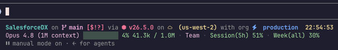

# Two Row Status Line for Claude Code

A cross-platform, configurable, two-row status line for Claude Code.



**Row 1 — your prompt.** Uses [Starship](https://starship.rs) if it's installed (so it matches your terminal exactly), or a built-in **native prompt** otherwise. No Starship required. Starship's `right_format` (e.g. a clock) is shown **inline** by default so it's always fully visible; set `RIGHT_ALIGN=true` to attempt flush-right (best-effort — see below).

**Row 2 — Claude info.** Model · context bar (`used / limit`, color-coded toward 100%) · plan (auto-detected) · Session(5h) and Week(all) rate-limit usage.

Everything is dynamic and per-user. Nothing personal is baked in.

## Layout

```
.
├── statusline.conf.example   # shared, editable config template
├── bash/
│   ├── statusline-command.sh # status line (macOS / Linux / Git Bash)
│   └── install.sh
├── powershell/
│   ├── statusline-command.ps1# status line (Windows)
│   └── install.ps1
├── README.md
├── TESTING.md
└── LICENSE
```

## Install

Run the installer for your OS from inside this folder, then **restart Claude Code**.

| OS | Command | Requirements |
|----|---------|--------------|
| **macOS / Linux** | `bash bash/install.sh` | `jq`, `git`; `starship` optional |
| **Windows** | `.\powershell\install.ps1` (in PowerShell) | none built-in; `git` + `starship` optional |

The installer copies the status-line script and a default `statusline.conf` into your `~/.claude/` (`%USERPROFILE%\.claude\` on Windows), points `statusLine` in your `settings.json` at it (merging — your other settings are preserved), and backs up anything it replaces (`*.bak-<timestamp>`). Safe to re-run; it never overwrites an existing `statusline.conf`.

## Testing

See **[TESTING.md](TESTING.md)** for a copy-paste checklist that verifies every
feature and config option (you can test without restarting Claude Code).

## Configure — `~/.claude/statusline.conf`

Plain `KEY=VALUE`. Edit, then start a new Claude Code session.

```ini
ROW1_SOURCE=auto        # auto | starship | native
USE_NERD_FONT=auto      # auto | true | false
MODULES="directory git_branch git_status git_state nodejs python golang rust ruby java package aws sfdx time"
DIR_TRUNCATE=3
TIME_FORMAT=%T
SEPARATOR=" "
BAR_WIDTH=10
CTX_YELLOW=70
CTX_RED=90
RL_YELLOW=70
RL_RED=90
USAGE_TYPE_OVERRIDE=    # empty = auto-detect plan
```

### Row 1: `ROW1_SOURCE`
- `auto` — Starship if installed, else the native prompt (recommended)
- `starship` — always Starship (falls back to native if not found)
- `native` — always the built-in native prompt

### Nerd Font icons: `USE_NERD_FONT`
Optional — the native prompt's icons come from a [Nerd Font](https://www.nerdfonts.com) (install one and set it as your terminal font to see them).
- `auto` — use icons **if a Nerd Font is installed** (detected once, then cached to `~/.claude/.statusline-nerdfont`), otherwise plain ASCII labels
- `true` / `false` — force on/off

> Auto-detect checks whether a Nerd Font is *installed*. It can't see which font your terminal is actually *using*, so if you have one installed but your terminal is set to a non-Nerd font (or vice-versa), set this to `true`/`false` explicitly. Delete the cache file to re-detect.

### Native prompt modules: `MODULES`
Space-separated, in display order. **Remove a name to disable that module entirely** — a disabled module runs no commands, so it's faster. Supported: `directory git_branch git_status git_state nodejs python golang rust ruby java package aws sfdx time`.

A couple of modules are less obvious than the language ones:
- **`sfdx`** — in a Salesforce DX project (a folder with `sfdx-project.json`), shows your default/target org read from `.sf/config.json` or `.sfdx/sfdx-config.json`, e.g. `with org production`.
- **`aws`** — shows your active AWS profile/region from the environment (`AWS_PROFILE`/`AWS_VAULT`, `AWS_REGION`).

These only apply to the **native** prompt. If you use Starship, its own config controls the equivalent modules (the screenshot above shows the SFDX org via a Starship custom module).

## Performance note

The native prompt is slower than Starship. Starship is a compiled binary that evaluates all modules in one parallelized process (~8 ms). The native prompt is a shell/PowerShell script that spawns a subprocess per check — and language modules (`node --version`, `python --version`, …) boot the whole runtime just to read a version, which is the main cost. With all modules on it can be ~100–300 ms; **trim `MODULES` to what you use** to speed it up. Language modules only run when a relevant project file is present, so unrelated directories stay cheap.

## How the data is sourced

- **Model, context tokens, rate limits** — from the JSON Claude Code pipes to the status-line command on stdin.
- **Plan** — read from the non-secret `oauthAccount.seatTier` in `~/.claude.json` (no tokens read).
- **Row 1** — Starship (`starship prompt`) or native module detection (git, language runtimes, AWS env, SFDX config, etc.).

## Known limitations

- **`RIGHT_ALIGN=true` can clip inside terminal wrappers that don't report the reflowed width.** Right-alignment needs the status line's true render width, but Claude Code only exposes `$COLUMNS`, and some terminal wrappers don't update it when their own chrome (e.g. a sidebar) shrinks the visible area. In that case the status line is told the *full* width, so right-aligned content is padded past the visible edge and the end gets clipped.
  - Confirmed with **CMUX**: with the sidebar expanded, the visible width drops (e.g. 239 → 198) but the status line still receives `COLUMNS=239`, so the right-aligned clock lands off-screen. This is a CMUX-side issue — it affects any TUI, not just this status line — tracked at [manaflow-ai/cmux#7205](https://github.com/manaflow-ai/cmux/issues/7205).
  - **Workaround:** use `RIGHT_ALIGN=false` (the default). Inline placement keeps everything near the left, so nothing is clipped regardless of sidebars or wrapper chrome.

## Notes & caveats

- **Two guaranteed shells:** bash (macOS/Linux) and PowerShell (Windows). `node`/`jq` aren't guaranteed on Windows, so the Windows script uses only built-in PowerShell.
- **Nerd Font glyphs** render only where a Nerd Font is installed *and* the terminal is set to use it — true on any OS. ASCII is the safe default.
- **`jq`** is required for the bash version (`brew install jq` / `apt-get install jq`). The PowerShell version needs nothing extra.
- Requires a font that renders block characters (`█ ░`) and `·` — virtually all modern fonts do.

## Disclaimer & attribution

This is an independent, community project. It is **not affiliated with, endorsed by, or sponsored by** any of the projects or companies below. All trademarks are the property of their respective owners; they are used here only nominatively, to describe compatibility.

- **Claude & Claude Code** are trademarks of **Anthropic, PBC**. This project is not an official Anthropic product. It only reads data Claude Code provides locally (status-line JSON on stdin and the non-secret `~/.claude.json`); it does not access Anthropic's APIs or your account, and reads no credentials or tokens.
- **Starship** is a separate open-source project (© its authors), used **only if you already have it installed** — it is not bundled or redistributed here. See [starship.rs](https://starship.rs). "Starship" is a trademark of its owners.
- **Nerd Fonts** is a separate open-source project (© Ryan L. McIntyre and contributors). No fonts are bundled or redistributed; the optional glyphs simply render if you have a Nerd Font installed, and each font carries its own license. See [nerdfonts.com](https://www.nerdfonts.com). "Nerd Fonts" is a trademark of its owners.
- **CMUX** is a separate open-source project (© [manaflow-ai](https://github.com/manaflow-ai/cmux) and contributors), referenced only in [Known limitations](#known-limitations) to describe a terminal-width behavior observed while running under it. The reference is descriptive, not a claim of any defect on their part, and is not affiliation or endorsement.

If you are a rights holder and have a concern with this project's naming or references, please open an issue and it will be addressed promptly.
